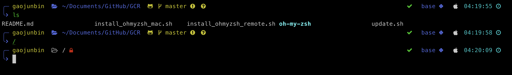

# GCR

### .ohmyshell

some common shell

1. How to use

   ```
   # for bash
   >> echo 'source ~/.ohmyshell' >> ~/.bashrc
   # for zsh, modify shell_file=~/.zshrc in .onmyzsh
   >> echo 'source ~/.ohmyshell' >> ~/.zshrc
   ```

2. Outline

   ```
   # =========Outline================
   # --- mytool - Some basic tools for common using.
   # |
   # --- myenv - Anaconda tools.
   # |
   # --- mygpu - useful functions for GPU and cuda.
   # |
   # --- mypermission - some functions for permission, passward, etc.
   # |
   # --- mygit - Git tools.
   # |
   # --- Others
   # ========Outline end============
   ```

   

### .ohmyzsh


1. How to use

   First, git clone this repo to $HOME.

   For Mac, you should spend some time to install Homebrew, and use homebrew to install some fonts and Iterm2.

   you can follow `install_ohmyzsh_mac.sh` to prepare your Mac. The main problem may network.

   

   For Remote host, e.g. Linux, just run

   ```
   sh $HOME/GCR/install_ohmyzsh_remote.sh
   ```

   

   
